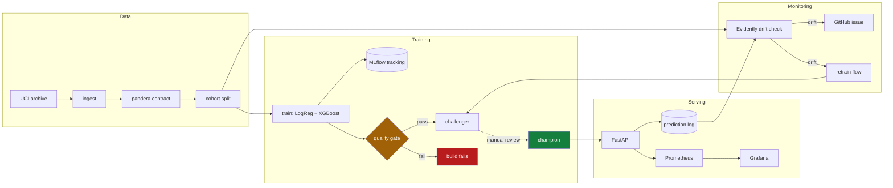

# Credit Default Prediction — End-to-End MLOps

[](https://github.com/ravisinghrajput95/mlops-credit-default/actions/workflows/ci.yml)

A production-shaped machine learning system, not a notebook. It predicts whether
a credit-card customer will default next month, and wraps that model in the
things that actually make ML work in production: a data contract, experiment
tracking, a model registry with gated promotion, a validated serving API,
drift monitoring, CI/CD, and infrastructure as code.

The model itself is deliberately unremarkable. The point is everything around it.

```bash
git clone https://github.com/ravisinghrajput95/mlops-credit-default.git
cd mlops-credit-default
make setup && make up
```

That brings up the whole stack. `make help` lists every workflow.

| Service | URL | What it shows |
| --- | --- | --- |
| API docs | http://localhost:8000/docs | Interactive OpenAPI, try a prediction |
| MLflow | http://localhost:5001 | Runs, metrics, registered models |
| Grafana | http://localhost:3000 | Live serving dashboard (`admin`/`admin`) |
| Prometheus | http://localhost:9090 | Raw metrics |
| Prefect | http://localhost:4200 | Flow runs |

---

## Architecture



The dotted line from challenger to champion is the only step in the whole system
that a human must take by hand. That is intentional — see Design decisions.

---

## The problem

**Dataset:** [UCI Default of Credit Card Clients](https://archive.ics.uci.edu/dataset/350/default+of+credit+card+clients)
— 30,000 customers, 23 features, binary target. Downloaded automatically; no
credentials needed.

**Class balance:** 22.1% default. This drives several decisions below.

**Model performance** (held-out test set, 4,500 rows):

| Model | PR-AUC | ROC-AUC | Brier |
| --- | --- | --- | --- |
| Logistic regression | 0.547 | 0.771 | 0.135 |
| **XGBoost** (champion) | **0.563** | **0.787** | **0.133** |
| No-skill baseline | 0.221 | 0.500 | — |

ROC-AUC of 0.787 is in line with published results on this dataset. A model that
scored much higher would be a sign of leakage, not skill.

---

## Design decisions

These are the choices worth arguing about, and why they went the way they did.

### PR-AUC, not accuracy

With a 22% positive rate, a model that predicts "no default" for everyone scores
78% accuracy and is completely useless. PR-AUC measures performance on the class
that actually matters, and its no-skill baseline is the positive rate itself
(0.221), so the number is honest about what the model adds.

### No class rebalancing

Balanced class weights and SMOTE both improve recall and destroy calibration. A
credit-risk score is only useful if 0.3 genuinely means a 30% chance — that is
what a lending decision is priced against. The imbalance is handled by choosing
the right *metric* rather than distorting the training distribution, and a
calibration curve is logged with every run as evidence.

### Preprocessing lives inside the model artifact

The `ColumnTransformer` and the estimator are fused into one `sklearn.Pipeline`,
so the artifact is self-contained. Train/serve skew — where serving reimplements
preprocessing slightly differently from training — is the most common way a model
that looked good offline quietly degrades in production. Making it structurally
impossible is better than testing for it.

### Promotion is manual

Training registers a challenger. Nothing automatic ever promotes it to champion.
Detected drift is frequently a broken upstream feed rather than a real population
shift, and an unattended pipeline that retrains on a broken feed will faithfully
learn the bug and ship it. The automation does everything up to the decision,
then stops and tells a human what it found.

### Drift monitoring instead of accuracy monitoring

Whether a customer actually defaults is known months after the prediction is
served. Waiting for labels means discovering a broken model a quarter late. So
the system monitors what is observable now: input feature distributions
(Evidently) and the distribution of predicted scores (a Prometheus histogram).

### No managed database in the cloud

Cloud SQL has no always-free tier and would have been the only line item on the
bill. MLflow therefore runs in the local compose stack, and Cloud Run loads its
model from object storage instead. The `PredictionSink` interface has a Postgres
implementation for local use and a GCS Parquet implementation for the cloud, so
application code is identical either way.

---

## What is real and what is simulated

Portfolio projects are easy to oversell. To be explicit:

| | Status |
| --- | --- |
| Dataset | **Real.** Public UCI data, downloaded at runtime. |
| Model and metrics | **Real.** Reproducible with `make pipeline`. |
| Serving, monitoring, CI/CD | **Real.** Runs locally; CI runs on every push. |
| **Data drift** | **Simulated.** See below. |
| Cloud deployment | **Real but ephemeral.** Torn down between demos. |
| AWS deployment | **Not built.** See `infra/aws/README.md`. |

The dataset is a single static snapshot with no time dimension, so it contains no
genuine drift to detect. `scripts/simulate_drift.py` injects an explicit,
documented shift — a credit downturn: repayment statuses slip later, credit
limits tighten, customers pay down less — so the monitoring and retraining path
can be demonstrated. The script prints a warning saying so every time it runs.

Try it:

```bash
make drift            # baseline: 0/23 columns drifted
make simulate-drift   # inject the synthetic shift
make drift            # now 8/23 columns drifted, exits non-zero
make split            # restore the clean cohort (the split is seeded)
```

---

## Repository layout

```
src/credit_default/
  config.py              env-driven settings, shared by every entrypoint
  data/schema.py         the pandera data contract - runs in CI
  data/split.py          seeded reference / current / train / test cohorts
  features/pipeline.py   preprocessing fused with the estimator
  train.py               candidates, MLflow logging, registry
  evaluate.py            quality gate (exits non-zero to fail a build)
  promote.py             gated champion promotion
  monitoring/drift.py    Evidently drift check
  api/                   FastAPI app, model loading, prediction sinks
flows/pipeline.py        Prefect: training, drift, retrain-on-drift
infra/gcp/               Terraform: budget first, then free-tier resources
.github/workflows/       CI, CD, scheduled drift check
```

---

## Quality gates

Three independent gates, each of which fails a build rather than warning:

1. **Data contract** (`data/schema.py`) — dtypes, ranges, nulls, allowed
   categories. CI validates the *live* UCI file, which is what catches the
   upstream source changing shape.
2. **Model quality** (`evaluate.py`) — an absolute PR-AUC floor, plus a
   regression check against the incumbent champion. The floor alone would miss a
   model that is merely worse; the regression check catches it.
3. **Image size** (`ci.yml`) — fails above 450 MB, so exceeding Artifact
   Registry's 0.5 GB free tier is caught in CI rather than on a bill.

The gates are tested in both directions: a deliberately bad model is rejected,
and run-to-run noise is not.

---

## Deploying to GCP

Everything is inside GCP's always-free tier. **Expected cost: Rs 0.**

```bash
cp infra/gcp/example.tfvars infra/gcp/terraform.tfvars   # then edit
make cloud-init
make cloud-up          # budget alert is created before anything billable
make publish-model     # copy the champion to GCS
make cloud-down        # tear it down when you are done
```

Three guardrails are built in, because a portfolio project should not generate a
surprise bill:

- The **billing budget and alert are created first**, before any resource that
  can spend money.
- The region variable **rejects anything but a US region** at plan time. Cloud
  Storage's free 5 GB applies only to `us-central1`, `us-east1` and `us-west1`,
  so a stray region silently turns Rs 0 into a real charge.
- **Cloud Run scales to zero**, so an idle service costs nothing.

`terraform destroy` is the intended steady state. Screenshots, not a permanently
running service, are the durable artifact.

### Notes for anyone reproducing this

Environment problems that cost real time here, in case they save you some:

- **`docker image inspect --format {{.Size}}` is not portable.** Docker Desktop's
  containerd snapshotter reports *compressed* sizes; the classic overlay2 store
  on a CI runner reports *uncompressed* ones. The same image read as 253 MB
  locally and 799 MB in CI, which sent the size gate hunting bloat that was not
  there. The gate now measures compressed bytes, which is also the right number:
  that is what a registry stores and bills.
- **`uv sync` installs the default dependency-group unless you pass `--no-dev`**,
  which quietly shipped mypy, pytest, ruff and pre-commit into the runtime image.
- **Pin `uv` in the Dockerfile to the version that wrote `uv.lock`.** An older uv
  reading a newer lockfile revision does not fail loudly; it just resolves
  differently from what you tested locally.
- **The xgboost PyPI wheel bundles about 290 MB of CUDA libraries** that a CPU
  container can never use. `xgboost-cpu` is the same library without them.
- **macOS binds port 5000** to the AirPlay Receiver, which accepts TCP
  connections and then resets them. MLflow is published on 5001 here.
- **MLflow 3 rejects unrecognised Host headers** as a DNS-rebinding defence.
  In-container calls arrive as `Host: mlflow:5000` and get a 403 until the
  service name is added to `--allowed-hosts`.
- **MLflow needs `--serve-artifacts`**, or it hands clients its own artifact path
  and they try to write it on their own filesystem.

The API image is 249 MB compressed, against a 400 MB CI budget and Artifact
Registry's 500 MB free tier.

---

## Development

```bash
make setup       # dependencies + pre-commit hooks
make check       # lint, types, tests - everything CI runs
make pipeline    # dvc repro: only re-runs stages whose inputs changed
```

Tests are hermetic: they build synthetic frames and never touch the network or a
live MLflow server, so `make test` works offline.

**Stack:** Python 3.12 · scikit-learn · XGBoost · MLflow · FastAPI · Evidently ·
Prefect · DVC · Docker · Prometheus · Grafana · Terraform · GitHub Actions
