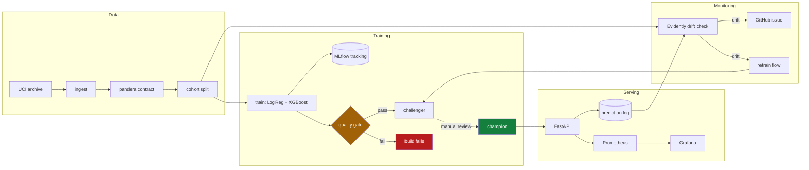

# Credit Default Prediction — End-to-End MLOps

[](https://github.com/ravisinghrajput95/mlops-credit-default/actions/workflows/ci.yml)

Deployed and verified on GCP, then torn down — see
[Deploying to GCP](#deploying-to-gcp). `make cloud-up` recreates the whole stack.

A production-shaped machine learning system, not a notebook. It predicts whether
a credit-card customer will default next month, and wraps that model in the
things that actually make ML work in production: a data contract, experiment
tracking, a model registry with gated promotion, a validated serving API,
drift monitoring, CI/CD, and infrastructure as code.

The model itself is deliberately unremarkable. The point is everything around it.

```bash
git clone https://github.com/ravisinghrajput95/mlops-credit-default.git
cd mlops-credit-default
make setup && make up
```

That brings up the whole stack. `make help` lists every workflow.

| Service | URL | What it shows |
| --- | --- | --- |
| API docs | http://localhost:8000/docs | Interactive OpenAPI, try a prediction |
| MLflow | http://localhost:5001 | Runs, metrics, registered models |
| Grafana | http://localhost:3000 | Live serving dashboard (`admin`/`admin`) |
| Prometheus | http://localhost:9090 | Raw metrics |
| Prefect | http://localhost:4200 | Flow runs |

---

## What it looks like

**Experiment tracking** — both candidates logged with the metrics that matter.
XGBoost (PR-AUC 0.563) beats the logistic-regression baseline (0.547).


**Model registry** — version 1 serves traffic as `@champion` while version 2 sits
as `@challenger`. Nothing promotes automatically; that gap is the point.


**Live serving dashboard** — RED metrics plus the predicted-probability
distribution, provisioned from JSON in this repo rather than clicked together.


**Score distribution over time** — the earliest drift signal available when
ground-truth labels are months away.


**Drift detection** — 8 of 23 columns flagged after the synthetic shift, with
reference and current distributions side by side.


**Alerting** — four rules provisioned from files, not clicked together. All
`Provisioned`, all evaluating healthy against live data.


**Validated API** — the request schema is generated from the same contract the
training data is validated against, so malformed input gets a 422, not a
prediction.


---

## Architecture



The dotted line from challenger to champion is the only step in the whole system
that a human must take by hand. That is intentional — see Design decisions.

---

## The problem

**Dataset:** [UCI Default of Credit Card Clients](https://archive.ics.uci.edu/dataset/350/default+of+credit+card+clients)
— 30,000 customers, 23 features, binary target. Downloaded automatically; no
credentials needed.

**Class balance:** 22.1% default. This drives several decisions below.

**Model performance** (held-out test set, 4,500 rows):

| Model | PR-AUC | ROC-AUC | Brier |
| --- | --- | --- | --- |
| Logistic regression | 0.547 | 0.773 | 0.136 |
| XGBoost, hand-picked params | 0.563 | 0.787 | 0.133 |
| **XGBoost, tuned** (champion) | **0.566** | **0.791** | **0.132** |
| No-skill baseline | 0.221 | 0.500 | — |

Trained on 20 features, not the dataset's 23 — see
[Protected attributes](#protected-attributes-and-what-excluding-them-actually-costs).

ROC-AUC of 0.787 is in line with published results on this dataset. A model that
scored much higher would be a sign of leakage, not skill.

---

## Design decisions

These are the choices worth arguing about, and why they went the way they did.

### PR-AUC, not accuracy

With a 22% positive rate, a model that predicts "no default" for everyone scores
78% accuracy and is completely useless. PR-AUC measures performance on the class
that actually matters, and its no-skill baseline is the positive rate itself
(0.221), so the number is honest about what the model adds.

### No class rebalancing

Balanced class weights and SMOTE both improve recall and destroy calibration. A
credit-risk score is only useful if 0.3 genuinely means a 30% chance — that is
what a lending decision is priced against. The imbalance is handled by choosing
the right *metric* rather than distorting the training distribution, and a
calibration curve is logged with every run as evidence.

### Preprocessing lives inside the model artifact

The `ColumnTransformer` and the estimator are fused into one `sklearn.Pipeline`,
so the artifact is self-contained. Train/serve skew — where serving reimplements
preprocessing slightly differently from training — is the most common way a model
that looked good offline quietly degrades in production. Making it structurally
impossible is better than testing for it.

### Promotion is manual

Training registers a challenger. Nothing automatic ever promotes it to champion.
Detected drift is frequently a broken upstream feed rather than a real population
shift, and an unattended pipeline that retrains on a broken feed will faithfully
learn the bug and ship it. The automation does everything up to the decision,
then stops and tells a human what it found.

### Protected attributes, and what excluding them actually costs

The UCI dataset ships `SEX`, `MARRIAGE` and `AGE` as features. Under the Equal
Credit Opportunity Act these are prohibited bases for a credit decision: sex and
marital status may never be used, and age only inside a formally validated
scorecard. A model that uses them is not a modelling choice, it is a compliance
failure. **All three are excluded from the feature set.**

They are *not* deleted from the data. You cannot audit a group you did not
record, so they stay in the dataset and in the API contract and are used purely
for measurement. `/model-info` reports exactly which attributes the model is
forbidden from using.

`scripts/fairness_report.py` trains both variants and compares them, so the
tradeoff is measured rather than asserted:

| | Features | PR-AUC | ROC-AUC |
| --- | --- | --- | --- |
| With protected attributes | 23 | 0.5633 | 0.7868 |
| Without (shipped) | 20 | 0.5626 | 0.7870 |
| **Cost of exclusion** | | **−0.0007** | **+0.0002** |

**Compliance costs essentially nothing here.** PR-AUC drops by 0.0007 and ROC-AUC
marginally improves — well inside run-to-run noise. When the legally required
choice is also free, there is nothing to trade off.

The fairness picture is more interesting, and two results are worth stating
plainly because they cut against the easy story:

| Attribute | Selection gap (with → without) | Base-rate gap in the data |
| --- | --- | --- |
| SEX | 0.0337 → **0.0216** | 0.0214 |
| AGE | 0.0918 → **0.0487** | 0.0909 |
| MARRIAGE | 0.0413 → **0.0475** | 0.0418 |
| EDUCATION *(kept)* | 0.1769 → 0.1664 | 0.1882 |

1. **Excluding an attribute does not remove its influence.** The gaps shrink but
   never vanish, because other features correlate with the protected ones and the
   model reconstructs them. For `SEX` the remaining gap (0.0216) is now almost
   exactly the real difference in the data (0.0214) — the model stopped
   amplifying it, which is the best available outcome, not a clean zero.
   "Fairness through unawareness" is not a solution, and this is the measurement
   that shows it.
2. **`MARRIAGE` got slightly worse**, on both selection rate and equal
   opportunity. Removing a protected attribute can degrade fairness on that
   attribute, because the model loses the ability to correct for it directly.
   That is a real result and it is reported rather than buried.
3. **The largest disparity is in `EDUCATION`, which is not a protected class at
   all** — a selection gap of 0.166 and an equal-opportunity gap of 0.46, far
   worse than anything ECOA covers. Legal compliance and fairness are not the
   same target, and optimising only for the first would miss this entirely.

Every run logs these gaps to MLflow (`fairness_*` metrics), so fairness is
tracked over time like any other metric rather than checked once and forgotten.

Two mutually incompatible definitions are reported side by side — demographic
parity and equal opportunity — because they cannot both hold unless base rates
are equal. Picking between them is a policy decision for legal and compliance,
not something this repository should quietly settle.

### Hyperparameter search, and reporting what it was worth

`make tune` runs a 30-trial Optuna search (TPE sampler) optimising PR-AUC by
stratified cross-validation **on the training set only** — selecting
hyperparameters by test score would make the reported test number meaningless.
Every trial is a nested MLflow run, so the search is inspectable rather than
collapsing to a single best number.

| | CV PR-AUC | Test PR-AUC | Test ROC-AUC |
| --- | --- | --- | --- |
| Hand-picked | 0.5516 | 0.5626 | 0.7870 |
| **Tuned (30 trials)** | **0.5577** | **0.5657** | **0.7913** |

The gain is modest — +0.006 CV, +0.003 on test — but it transferred to held-out
data rather than only improving the score it was selected on, which is the check
that matters. `scripts/tune.py` prints the comparison against the hand-picked
baseline explicitly, because "tuning bought almost nothing" is a legitimate and
useful result that a search reporting only its winner would hide.

Tuning is optional: `train.py` picks up `reports/best_params.json` if it exists
and falls back to the hand-picked defaults otherwise, so a clean clone trains
without first spending minutes on a search.

### The decision threshold comes from cost, not from 0.5

A classifier outputs a probability; turning that into approve/decline needs a
cutoff. **0.5 is not a neutral default** — it is optimal only when a false
positive and a false negative cost exactly the same, which in lending they do not.
Approving someone who defaults loses much of the balance; declining someone who
would have repaid loses one account's margin.

The cutoff is chosen by minimising expected cost, using a 5:1 ratio between the
two error types. For a calibrated model the optimum has a closed form,
`cost_fp / (cost_fn + cost_fp)`, which is what the tests assert against rather
than checking the search against another run of itself.

| | Threshold | Expected cost | Declined |
| --- | --- | --- | --- |
| Convention | 0.50 | 0.741 | 17% |
| **Cost-optimal** | **0.18** | **0.556** | **39%** |

That is a 25% reduction in expected cost — and a decline rate that jumps from 17%
to 39%. **A lender rejecting 39% of applicants is probably commercially
unacceptable**, which is the honest reading of this result: it says the 5:1 ratio
is a placeholder, not that the business should decline four applicants in ten.
The ratio is exposed as configuration because it is a business input to be
derived from exposure at default, recovery rate and per-account margin — not a
modelling constant to be guessed once.

Two implementation details that matter more than they look:

- The threshold is tuned on **out-of-fold predictions over the training set**,
  never on test. Tuning on test would make the reported test metrics optimistic,
  since the cutoff would have been fitted to the data used to judge it.
- It travels **inside the model artifact's metadata**, so serving uses the cutoff
  the model was tuned for. A constant in the API would silently drift away from
  the model it serves — which it did, until every persistence path was fixed to
  carry it.

### Drift monitoring instead of accuracy monitoring

Whether a customer actually defaults is known months after the prediction is
served. Waiting for labels means discovering a broken model a quarter late. So
the system monitors what is observable now: input feature distributions
(Evidently) and the distribution of predicted scores (a Prometheus histogram).

### No managed database in the cloud

Cloud SQL has no always-free tier and would have been the only line item on the
bill. MLflow therefore runs in the local compose stack, and Cloud Run loads its
model from object storage instead. The `PredictionSink` interface has a Postgres
implementation for local use and a GCS Parquet implementation for the cloud, so
application code is identical either way.

---

## What is real and what is simulated

Portfolio projects are easy to oversell. To be explicit:

| | Status |
| --- | --- |
| Dataset | **Real.** Public UCI data, downloaded at runtime. |
| Model and metrics | **Real.** Reproducible with `make pipeline`. |
| Serving, monitoring, CI/CD | **Real.** Runs locally; CI runs on every push. |
| **Data drift** | **Simulated.** See below. |
| Cloud deployment | **Real but ephemeral.** Torn down between demos. |
| AWS deployment | **Not built.** See `infra/aws/README.md`. |

The dataset is a single static snapshot with no time dimension, so it contains no
genuine drift to detect. `scripts/simulate_drift.py` injects an explicit,
documented shift — a credit downturn: repayment statuses slip later, credit
limits tighten, customers pay down less — so the monitoring and retraining path
can be demonstrated. The script prints a warning saying so every time it runs.

Try it:

```bash
make drift            # baseline: 0/23 columns drifted
make simulate-drift   # inject the synthetic shift
make drift            # now 8/23 columns drifted, exits non-zero
make split            # restore the clean cohort (the split is seeded)
```

---

## Repository layout

```
src/credit_default/
  config.py              env-driven settings, shared by every entrypoint
  data/schema.py         the pandera data contract - runs in CI
  data/split.py          seeded reference / current / train / test cohorts
  features/pipeline.py   preprocessing fused with the estimator
  train.py               candidates, MLflow logging, registry
  evaluate.py            quality gate (exits non-zero to fail a build)
  promote.py             gated champion promotion
  fairness.py            group fairness audit (ECOA-protected attributes)
  threshold.py           cost-optimal decision cutoff
  tuning.py              Optuna hyperparameter search
  monitoring/drift.py    Evidently drift check
  api/                   FastAPI app, model loading, prediction sinks
flows/pipeline.py        Prefect: training, drift, retrain-on-drift
infra/gcp/               Terraform: budget first, then free-tier resources
.github/workflows/       CI, CD, scheduled drift check
```

---

## Alerting and load

Dashboards nobody is watching are not monitoring. Four alert rules are
provisioned as code in `monitoring/grafana/provisioning/alerting/`:

| Rule | Fires when | Severity |
| --- | --- | --- |
| API error rate | >1% 5xx for 5 minutes | critical |
| p95 latency | >1s for 5 minutes | warning |
| Score distribution shifted | mean predicted probability outside 0.12–0.34 for 30 min | warning |
| No predictions served | silent for 15 minutes | warning |

Two details worth noting. Every rule sets `noDataState` explicitly — the default
turns a scrape gap into a page, which trains people to ignore alerts. And the
score-drift rule uses a deliberately long 30-minute window, because the score
distribution moves slowly and a shorter one fires on ordinary batch noise.

The notification path is wired end to end to a local receiver, so it can be shown
working without a Slack or PagerDuty account; swapping in a real one is a config
change. `docker compose logs alert-sink` shows what on-call would have been paged
with.

### Load

`make load-test` runs Locust against the local stack and **fails the process** if
p95 exceeds 1s or the error rate exceeds 1% — the same thresholds the alert rules
use, so a failing load test and a firing alert mean the same thing.

```
requests        3722
failures        0 (0.00%)
median          7 ms
p95             18 ms   (target < 1000 ms)
throughput      63.3 req/s
```

The interesting result is that batches of 10–50 rows add roughly 1ms over a
single row (8ms vs 7ms median). Inference is not the bottleneck at this scale;
per-request overhead is. That is worth knowing before optimising the wrong thing.

## Quality gates

Three independent gates, each of which fails a build rather than warning:

1. **Data contract** (`data/schema.py`) — dtypes, ranges, nulls, allowed
   categories. CI validates the *live* UCI file, which is what catches the
   upstream source changing shape.
2. **Model quality** (`evaluate.py`) — an absolute PR-AUC floor, plus a
   regression check against the incumbent champion. The floor alone would miss a
   model that is merely worse; the regression check catches it.
3. **Image size** (`ci.yml`) — fails above 450 MB, so exceeding Artifact
   Registry's 0.5 GB free tier is caught in CI rather than on a bill.

The gates are tested in both directions: a deliberately bad model is rejected,
and run-to-run noise is not.

---

## Deploying to GCP

Everything is inside GCP's always-free tier. **Expected cost: Rs 0.**

```bash
cp infra/gcp/example.tfvars infra/gcp/terraform.tfvars   # then edit
make cloud-init
make cloud-up          # budget alert is created before anything billable
make publish-model     # copy the champion to GCS
make cloud-down        # tear it down when you are done
```

Three guardrails are built in, because a portfolio project should not generate a
surprise bill:

- The **billing budget and alert are created first**, before any resource that
  can spend money.
- The region variable **rejects anything but a US region** at plan time. Cloud
  Storage's free 5 GB applies only to `us-central1`, `us-east1` and `us-west1`,
  so a stray region silently turns Rs 0 into a real charge.
- **Cloud Run scales to zero**, so an idle service costs nothing.

This has been run for real, not just written. All 25 resources applied to a live
project, Cloud Run served the champion model loaded from GCS with predictions
written back as date-partitioned Parquet, the CD workflow deployed a new revision
authenticating through Workload Identity Federation with no stored key — and then
everything was destroyed. Total spend: Rs 0.

`terraform destroy` is the intended steady state, which is why the README leans on
screenshots rather than a permanently running URL.

Three defects in this Terraform only appeared on a real apply, never in
`validate`:

- `iam.googleapis.com` was missing from the enabled-services list, so service
  account creation failed with `accessNotConfigured`.
- The Billing Budgets API rejects user ADC without an attached quota project, so
  the budget failed to create while everything billable succeeded — the exact
  inverse of the guarantee above. Fixed with `billing_project` and
  `user_project_override` on the provider.
- Nothing actually enforced "budget first". That ordering was left to Terraform's
  scheduler, which created Cloud Run and both buckets in the same run where the
  budget errored. The billable resources now `depends_on` the budget explicitly.

### Notes for anyone reproducing this

Environment problems that cost real time here, in case they save you some:

- **`docker image inspect --format {{.Size}}` is not portable.** Docker Desktop's
  containerd snapshotter reports *compressed* sizes; the classic overlay2 store
  on a CI runner reports *uncompressed* ones. The same image read as 253 MB
  locally and 799 MB in CI, which sent the size gate hunting bloat that was not
  there. The gate now measures compressed bytes, which is also the right number:
  that is what a registry stores and bills.
- **`uv sync` installs the default dependency-group unless you pass `--no-dev`**,
  which quietly shipped mypy, pytest, ruff and pre-commit into the runtime image.
- **Pin `uv` in the Dockerfile to the version that wrote `uv.lock`.** An older uv
  reading a newer lockfile revision does not fail loudly; it just resolves
  differently from what you tested locally.
- **The xgboost PyPI wheel bundles about 290 MB of CUDA libraries** that a CPU
  container can never use. `xgboost-cpu` is the same library without them.
- **macOS binds port 5000** to the AirPlay Receiver, which accepts TCP
  connections and then resets them. MLflow is published on 5001 here.
- **MLflow 3 rejects unrecognised Host headers** as a DNS-rebinding defence.
  In-container calls arrive as `Host: mlflow:5000` and get a 403 until the
  service name is added to `--allowed-hosts`.
- **MLflow needs `--serve-artifacts`**, or it hands clients its own artifact path
  and they try to write it on their own filesystem.

The API image is 249 MB compressed, against a 400 MB CI budget and Artifact
Registry's 500 MB free tier.

---

## Development

```bash
make setup       # dependencies + pre-commit hooks
make check       # lint, types, tests - everything CI runs
make pipeline    # dvc repro: only re-runs stages whose inputs changed
```

Tests are hermetic: they build synthetic frames and never touch the network or a
live MLflow server, so `make test` works offline.

**Stack:** Python 3.12 · scikit-learn · XGBoost · MLflow · FastAPI · Evidently ·
Prefect · DVC · Docker · Prometheus · Grafana · Terraform · GitHub Actions
