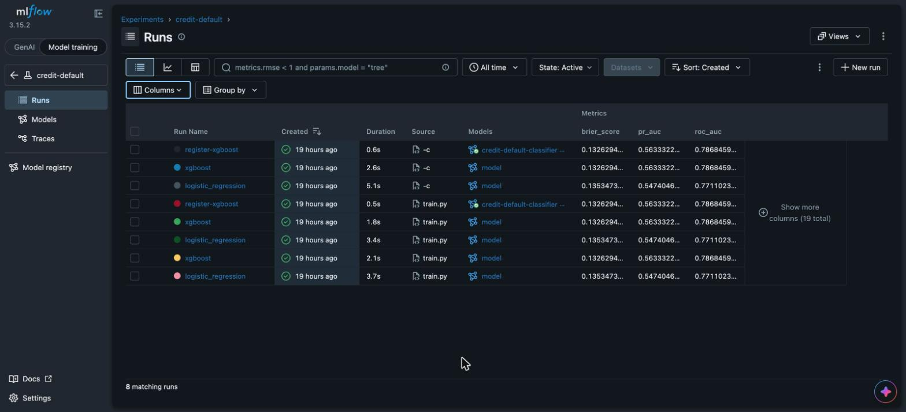
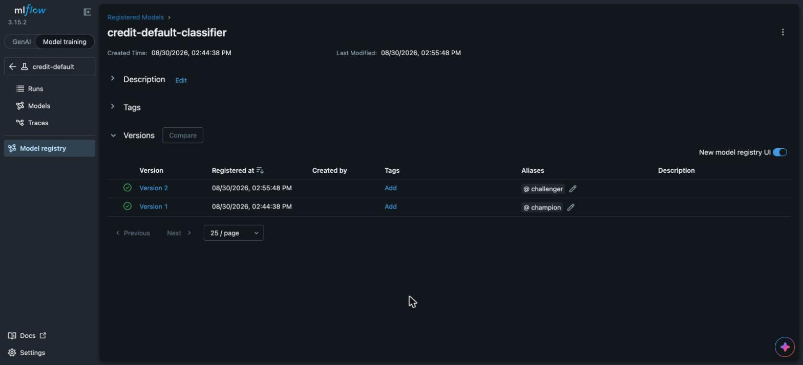
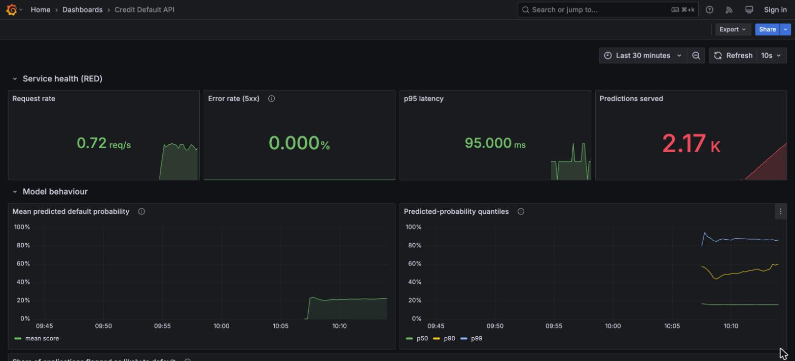
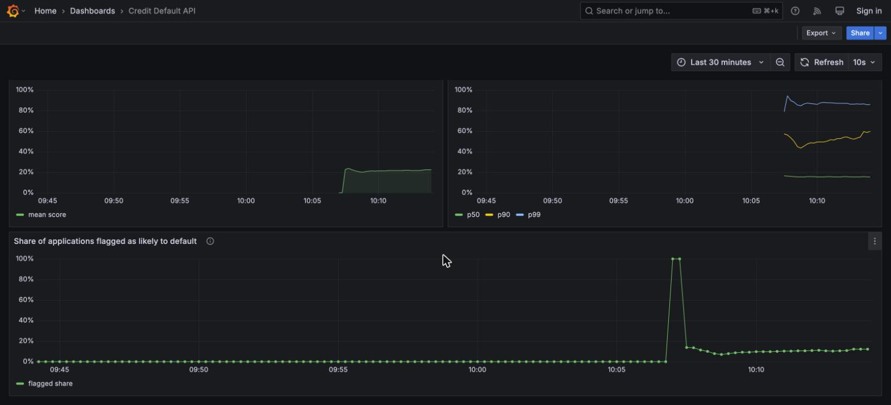
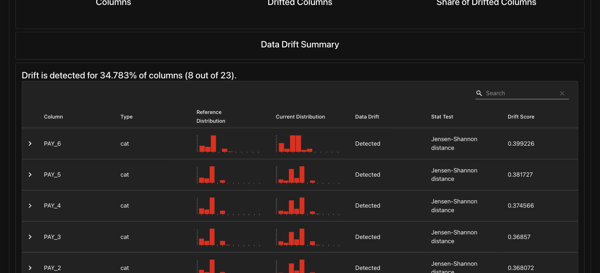
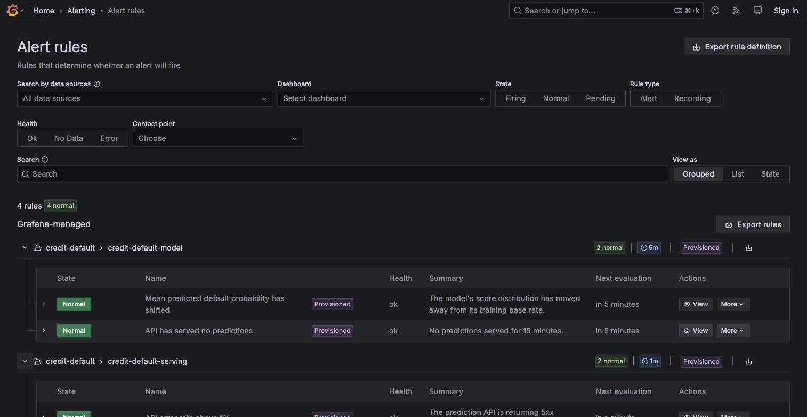
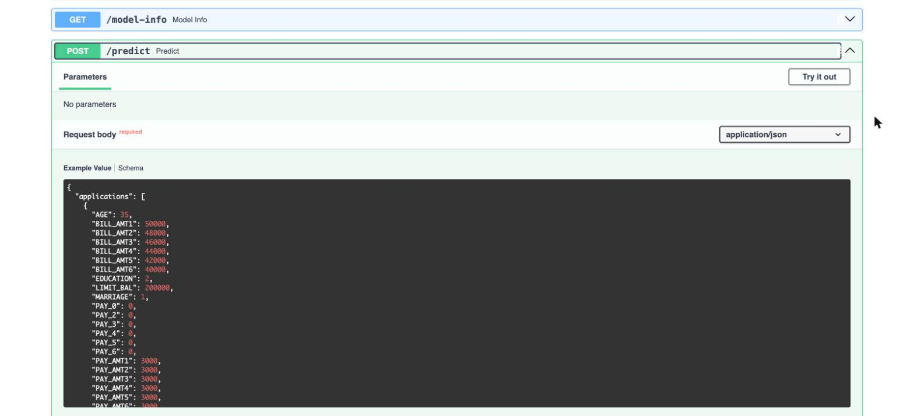
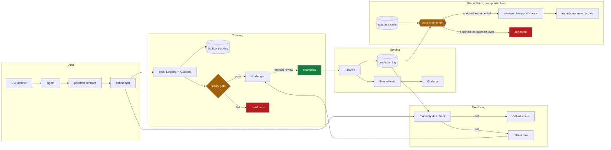

# Credit Default Prediction — End-to-End MLOps

[](https://github.com/ravisinghrajput95/mlops-credit-default/actions/workflows/ci.yml)

Deployed and verified on GCP, then torn down — see
[Deploying to GCP](#deploying-to-gcp). `make cloud-up` recreates the whole stack.

A production-shaped machine learning system, not a notebook. It predicts whether
a credit-card customer will default next month, and wraps that model in the
things that actually make ML work in production: a data contract, experiment
tracking, a model registry with gated promotion, a validated serving API,
drift monitoring, a delayed-label loop that closes back to measured performance,
CI/CD, and infrastructure as code.

The model itself is deliberately unremarkable. The point is everything around it.

```bash
git clone https://github.com/ravisinghrajput95/mlops-credit-default.git
cd mlops-credit-default
make setup && make up
```

That brings up the whole stack. `make help` lists every workflow.

| Service | URL | What it shows |
| --- | --- | --- |
| API docs | http://localhost:8000/docs | Interactive OpenAPI, try a prediction |
| MLflow | http://localhost:5001 | Runs, metrics, registered models |
| Grafana | http://localhost:3000 | Live serving dashboard (`admin`/`admin`) |
| Prometheus | http://localhost:9090 | Raw metrics |
| Prefect | http://localhost:4200 | Flow runs |

---

## What it looks like

**Experiment tracking** — both candidates logged with the metrics that matter.
XGBoost (PR-AUC 0.563) beats the logistic-regression baseline (0.547).



**Model registry** — version 1 serves traffic as `@champion` while version 2 sits
as `@challenger`. Nothing promotes automatically; that gap is the point.



**Live serving dashboard** — RED metrics plus the predicted-probability
distribution, provisioned from JSON in this repo rather than clicked together.



**Score distribution over time** — the earliest drift signal available when
ground-truth labels are months away.



**Drift detection** — 8 of 23 columns flagged after the synthetic shift, with
reference and current distributions side by side.



**Alerting** — four rules provisioned from files, not clicked together. All
`Provisioned`, all evaluating healthy against live data.



**Validated API** — the request schema is generated from the same contract the
training data is validated against, so malformed input gets a 422, not a
prediction. Every response carries an `application_id`, which is what makes the
outcome joinable when it turns up a quarter later.



---

## Architecture



The dotted line from challenger to champion is the only step in the whole system
that a human must take by hand. That is intentional — see Design decisions.

---

## The problem

**Dataset:** [UCI Default of Credit Card Clients](https://archive.ics.uci.edu/dataset/350/default+of+credit+card+clients)
— 30,000 customers, 23 features, binary target. Downloaded automatically; no
credentials needed.

**Class balance:** 22.1% default. This drives several decisions below.

**Model performance** (held-out test set, 4,500 rows):

| Model | PR-AUC | ROC-AUC | Brier |
| --- | --- | --- | --- |
| Logistic regression | 0.547 | 0.773 | 0.136 |
| XGBoost, hand-picked params | 0.563 | 0.787 | 0.133 |
| **XGBoost, tuned** (champion) | **0.566** | **0.791** | **0.132** |
| No-skill baseline | 0.221 | 0.500 | — |

Trained on 20 features, not the dataset's 23 — see
[Protected attributes](#protected-attributes-and-what-excluding-them-actually-costs).

ROC-AUC of 0.787 is in line with published results on this dataset. A model that
scored much higher would be a sign of leakage, not skill.

---

## Design decisions

These are the choices worth arguing about, and why they went the way they did.

### PR-AUC, not accuracy

With a 22% positive rate, a model that predicts "no default" for everyone scores
78% accuracy and is completely useless. PR-AUC measures performance on the class
that actually matters, and its no-skill baseline is the positive rate itself
(0.221), so the number is honest about what the model adds.

### No class rebalancing

Balanced class weights and SMOTE both improve recall and destroy calibration. A
credit-risk score is only useful if 0.3 genuinely means a 30% chance — that is
what a lending decision is priced against. The imbalance is handled by choosing
the right *metric* rather than distorting the training distribution, and a
calibration curve is logged with every run as evidence.

### Preprocessing lives inside the model artifact

The `ColumnTransformer` and the estimator are fused into one `sklearn.Pipeline`,
so the artifact is self-contained. Train/serve skew — where serving reimplements
preprocessing slightly differently from training — is the most common way a model
that looked good offline quietly degrades in production. Making it structurally
impossible is better than testing for it.

### Promotion is manual

Training registers a challenger. Nothing automatic ever promotes it to champion.
Detected drift is frequently a broken upstream feed rather than a real population
shift, and an unattended pipeline that retrains on a broken feed will faithfully
learn the bug and ship it. The automation does everything up to the decision,
then stops and tells a human what it found.

### Protected attributes, and what excluding them actually costs

The UCI dataset ships `SEX`, `MARRIAGE` and `AGE` as features. Under the Equal
Credit Opportunity Act these are prohibited bases for a credit decision: sex and
marital status may never be used, and age only inside a formally validated
scorecard. A model that uses them is not a modelling choice, it is a compliance
failure. **All three are excluded from the feature set.**

They are *not* deleted from the data. You cannot audit a group you did not
record, so they stay in the dataset and in the API contract and are used purely
for measurement. `/model-info` reports exactly which attributes the model is
forbidden from using.

`scripts/fairness_report.py` trains both variants and compares them, so the
tradeoff is measured rather than asserted:

| | Features | PR-AUC | ROC-AUC |
| --- | --- | --- | --- |
| With protected attributes | 23 | 0.5633 | 0.7868 |
| Without (shipped) | 20 | 0.5626 | 0.7870 |
| **Cost of exclusion** | | **−0.0007** | **+0.0002** |

**Compliance costs essentially nothing here.** PR-AUC drops by 0.0007 and ROC-AUC
marginally improves — well inside run-to-run noise. When the legally required
choice is also free, there is nothing to trade off.

The fairness picture is more interesting, and two results are worth stating
plainly because they cut against the easy story:

| Attribute | Selection gap (with → without) | Base-rate gap in the data |
| --- | --- | --- |
| SEX | 0.0337 → **0.0216** | 0.0214 |
| AGE | 0.0918 → **0.0487** | 0.0909 |
| MARRIAGE | 0.0413 → **0.0475** | 0.0418 |
| EDUCATION *(kept)* | 0.1769 → 0.1664 | 0.1882 |

1. **Excluding an attribute does not remove its influence.** The gaps shrink but
   never vanish, because other features correlate with the protected ones and the
   model reconstructs them. For `SEX` the remaining gap (0.0216) is now almost
   exactly the real difference in the data (0.0214) — the model stopped
   amplifying it, which is the best available outcome, not a clean zero.
   "Fairness through unawareness" is not a solution, and this is the measurement
   that shows it.
2. **`MARRIAGE` got slightly worse**, on both selection rate and equal
   opportunity. Removing a protected attribute can degrade fairness on that
   attribute, because the model loses the ability to correct for it directly.
   That is a real result and it is reported rather than buried.
3. **The largest disparity is in `EDUCATION`, which is not a protected class at
   all** — a selection gap of 0.166 and an equal-opportunity gap of 0.46, far
   worse than anything ECOA covers. Legal compliance and fairness are not the
   same target, and optimising only for the first would miss this entirely.

Every run logs these gaps to MLflow (`fairness_*` metrics), so fairness is
tracked over time like any other metric rather than checked once and forgotten.

Two mutually incompatible definitions are reported side by side — demographic
parity and equal opportunity — because they cannot both hold unless base rates
are equal. Picking between them is a policy decision for legal and compliance,
not something this repository should quietly settle.

### Hyperparameter search, and reporting what it was worth

`make tune` runs a 30-trial Optuna search (TPE sampler) optimising PR-AUC by
stratified cross-validation **on the training set only** — selecting
hyperparameters by test score would make the reported test number meaningless.
Every trial is a nested MLflow run, so the search is inspectable rather than
collapsing to a single best number.

| | CV PR-AUC | Test PR-AUC | Test ROC-AUC |
| --- | --- | --- | --- |
| Hand-picked | 0.5516 | 0.5626 | 0.7870 |
| **Tuned (30 trials)** | **0.5577** | **0.5657** | **0.7913** |

The gain is modest — +0.006 CV, +0.003 on test — but it transferred to held-out
data rather than only improving the score it was selected on, which is the check
that matters. `scripts/tune.py` prints the comparison against the hand-picked
baseline explicitly, because "tuning bought almost nothing" is a legitimate and
useful result that a search reporting only its winner would hide.

Tuning is optional: `train.py` picks up `reports/best_params.json` if it exists
and falls back to the hand-picked defaults otherwise, so a clean clone trains
without first spending minutes on a search.

### Per-decision explanations, because a decline needs a reason

Under ECOA and Regulation B, a declined applicant must be told the **principal
reasons** — not a score, and not "the model said so". A model that cannot explain
an individual decision is not deployable in consumer lending however well it
ranks.

`POST /predict` with `"explain": true` returns SHAP attributions per application:

```json
{
  "application_id": "APP-000123",
  "probability": 0.7958,
  "prediction": 1,
  "reasons": [
    {"description": "repayment status in the most recent month", "value": 2,
     "contribution": 1.0412, "direction": "increased_risk"},
    {"description": "repayment status two months ago", "value": 2,
     "contribution": 0.2740, "direction": "increased_risk"}
  ]
}
```

Four things this gets right that a feature-importance ranking would not:

- **The attributions are exact and additive.** Base value plus contributions
  reconstructs the model's raw output to within 1e-6, which is asserted in the
  tests. That property is what makes SHAP defensible to a regulator; global
  importance says nothing about the individual in front of you.
- **Contributions are attributed to source columns, not encoded ones.** The model
  sees `PAY_0_2`; the applicant hears "repayment status in the most recent month".
  The mapping is built from the fitted transformer's structure rather than by
  parsing names — `PAY_0_-1` and `PAY_AMT1` are not separable by prefix.
- **A decline reports only risk-increasing factors.** Listing what *helped* an
  applicant who was refused is not an adverse-action reason.
- **Protected attributes can never appear**, since they are not model inputs. A
  test asserts it.

Opt-in, because it costs latency. Measured overhead:

| Batch size | Without | With | Overhead |
| --- | --- | --- | --- |
| 1 | 3.3ms | 6.6ms | +3.3ms |
| 50 | 4.2ms | 12.6ms | +8.4ms |
| 200 | 6.6ms | 37.6ms | +31.0ms |

Roughly double for a single decision, which is nothing when that decision is
going to be communicated to a person. A bulk scoring job that will never send a
notice should not pay it.

Explanations are best-effort: if the explainer fails, the caller gets the
prediction with reasons omitted rather than a 500. Refusing to answer at all is
the worse failure.

### The decision threshold comes from cost, not from 0.5

A classifier outputs a probability; turning that into approve/decline needs a
cutoff. **0.5 is not a neutral default** — it is optimal only when a false
positive and a false negative cost exactly the same, which in lending they do not.
Approving someone who defaults loses much of the balance; declining someone who
would have repaid loses one account's margin.

The cutoff is chosen by minimising expected cost, using a 5:1 ratio between the
two error types. For a calibrated model the optimum has a closed form,
`cost_fp / (cost_fn + cost_fp)`, which is what the tests assert against rather
than checking the search against another run of itself.

| | Threshold | Expected cost | Declined |
| --- | --- | --- | --- |
| Convention | 0.50 | 0.741 | 17% |
| **Cost-optimal** | **0.18** | **0.556** | **39%** |

That is a 25% reduction in expected cost — and a decline rate that jumps from 17%
to 39%. **A lender rejecting 39% of applicants is probably commercially
unacceptable**, which is the honest reading of this result: it says the 5:1 ratio
is a placeholder, not that the business should decline four applicants in ten.
The ratio is exposed as configuration because it is a business input to be
derived from exposure at default, recovery rate and per-account margin — not a
modelling constant to be guessed once.

Two implementation details that matter more than they look:

- The threshold is tuned on **out-of-fold predictions over the training set**,
  never on test. Tuning on test would make the reported test metrics optimistic,
  since the cutoff would have been fitted to the data used to judge it.
- It travels **inside the model artifact's metadata**, so serving uses the cutoff
  the model was tuned for. A constant in the API would silently drift away from
  the model it serves — which it did, until every persistence path was fixed to
  carry it.

### Authentication, and recording who asked

`/predict` and `/model-info` require `Authorization: Bearer <key>`. `/health` and
`/metrics` do not, and that split is a design decision rather than an oversight:
Cloud Run's startup and liveness probes hit `/health`, and Prometheus scrapes
`/metrics` unauthenticated. Putting a key in front of either converts a
monitoring gap into an outage, or a probe failure into a crash loop.

Keys are configured as `name:secret` pairs, and **the name is the point**. A
credit decision is a regulated act, so the caller is written into the prediction
log beside the score and the reasons — `batch-scoring`, not "someone with a valid
key". The adverse-action work already answers *why* an applicant was declined;
this answers *who asked*, which is the other half of the same audit trail.

Four decisions worth defending:

- **Misconfiguration fails closed.** If authentication is demanded and no keys
  are configured, the process refuses to start. This is deliberately the opposite
  of how the model loader behaves — a missing model degrades `/health` and keeps
  serving, because an API reporting its own illness beats a crash loop. A missing
  key list cannot degrade that way, because "no keys" would mean "nobody can be
  rejected". An endpoint that has quietly stopped checking is worse than one that
  is plainly down. A test asserts the app actually fails to start, not merely
  that the constructor raises.
- **A bad key is 401, never 403.** 403 means "we know who you are and you may
  not". There is no authorisation layer here, so every rejection is a failure to
  authenticate. Returning 403 misreports the failure to the caller and to whoever
  reads the logs.
- **Every key is compared, every time.** `secrets.compare_digest`, and no early
  return on the first match — stopping early would make response time depend on a
  key's position in the list, which is the same leak constant-time comparison
  exists to close. The measured cost of that choice:

  | Configured keys | Per check |
  | --- | --- |
  | 1 | 0.09 µs |
  | 10 | 0.39 µs |
  | 50 | 1.64 µs |

  Against a ~3 ms request even the 50-key case is 0.05% of the latency budget,
  and end-to-end the difference is not measurable above run-to-run jitter. There
  was no trade to make here, which is worth knowing rather than assuming.
- **Keys cannot reach a log.** They are held in a `SecretStr`, so a stray
  `repr(settings)` in a traceback or a Prefect run log prints `**********`. A
  rejected key is not echoed either — a wrong credential is still a credential,
  and log aggregators are not secret stores. Both are asserted.

**It is off by default**, which is a real trade and not one made quietly: a clean
clone has to run with no setup, so the API instead logs a warning on every
unauthenticated boot. `docker-compose` passes `REQUIRE_AUTH` and `API_KEYS`
through from the host rather than committing a key, and the Terraform variable
has **no default at all**, so deploying forces the decision rather than
inheriting one.

```bash
export API_KEYS="local:$(python -c 'import secrets; print(secrets.token_urlsafe(32))')"
export REQUIRE_AUTH=true && make up
```

A route-protection test enumerates every route in the app and asserts each one is
either on an explicit public list or behind the dependency. Adding an endpoint
without deciding who may call it fails the build rather than shipping open, which
is the failure this feature is most likely to have in six months.

Verified against a running server rather than only in the test suite: `/health`
and `/metrics` answered 200 with no credential, `/predict` and `/model-info`
returned 401 with a `WWW-Authenticate: Bearer` challenge, a wrong key returned
401 rather than 403, a valid one returned 200, the key appeared zero times in the
logs, and a process started with `REQUIRE_AUTH=true` and no keys exited non-zero
instead of serving. The `caller` column migration was applied twice against the
live 26,113-row table with the rows untouched.

**What is not built:** per-key rate limiting, key rotation or expiry, and any
authorisation layer — every valid key can do everything. Bearer keys are shared
secrets with no per-user identity; a lender would want OIDC with a real
principal. The Terraform change is also the one piece of this repository that has
been `validate`d but never applied to a live project, since GCP is currently torn
down — and this README already documents three Terraform defects that only
appeared on a real apply, so treat it accordingly.

### Drift monitoring instead of accuracy monitoring

Whether a customer actually defaults is known months after the prediction is
served. Waiting for labels means discovering a broken model a quarter late. So
the system monitors what is observable now: input feature distributions
(Evidently) and the distribution of predicted scores (a Prometheus histogram).

Drift is the signal available *now*. The next section is the truth, available a
quarter late. Both are needed and neither replaces the other.

### Labels arrive months late, and almost everything about that is a trap

`make labels` runs the whole delayed-label loop and prints the numbers below.

The obvious version of this feature is a table of outcomes and a join. Building
it that way produces a number that is wrong in three independent directions at
once, and every one of them makes the model look better or worse than it is
without ever looking broken. So each is measured.

**Before any of it, a prediction has to be addressable.** `/predict` used to return a score
and nothing else, while the sink recorded a random UUID it never told anyone. An
outcome arriving four months later had nothing to join to. Applications now carry
an optional `application_id`, echoed in the response and generated when omitted;
it is stripped before the frame reaches the model, because it identifies the
decision rather than describing the applicant. A test asserts it never reaches
the feature set. This is a small change that the rest of the section depends on
completely: **a prediction nobody can name is a prediction nobody can learn
from.**

**First, there are three timestamps, not one.** The outcome becomes *defined*
when the performance window closes (`matures_at`); it becomes *known* when the
servicing file lands (`observed_at`); those are different dates and neither is
the decision date. An evaluation dated `T` may only use predictions matured by
`T` and outcomes reported by `T`.

`labels/backfill.py` ships both the correct join and the naive one, because the
gap between them is the argument for the correct one:

| Join, evaluating as of day 150 | Rows scored | Observed default rate | PR-AUC |
| --- | --- | --- | --- |
| Point-in-time correct | 1,861 | 0.0790 | 0.1653 |
| Naive (joins on the key alone) | 4,428 | 0.1098 | 0.2010 |
| **Imported from the future** | **2,567** | | **+0.0356** |

The naive join is not subtly wrong; it silently more than doubles the evaluation
set with rows nobody had yet, and it reports a **better** score for doing it. It
is kept in the source so a test can assert the two disagree — if they ever
coincide, the guarantee has quietly evaporated while every other test still
passes.

**Second, an immature cohort does not look incomplete. It looks healthy.** A
non-default is known the moment the window closes: nothing happened. A default
has to be established through missed payments, collections and charge-off, so it
lands later. The observable default rate therefore starts low and climbs as the
slow tail arrives:

| As of | Matured | Coverage | Labels | Observed default rate | Observed PR-AUC |
| --- | --- | --- | --- | --- | --- |
| day 90 | 34% | 18% | 467 | 0.0345 | 0.0648 |
| day 180 | 84% | 41% | 2,551 | 0.0824 | 0.1273 |
| day 270 | 100% | 57% | 4,284 | 0.0937 | 0.1376 |
| day 400 | 100% | 59% | 4,428 | **0.1060** | 0.1564 |

The observed default rate triples between day 90 and day 400. **Nothing about the
model or the population changed** — those are the same 7,500 decisions on the same
data throughout. A dashboard comparing this month's observed rate against last
month's would report a large, sustained, entirely fictional improvement in
portfolio quality, and a retraining job triggered on that signal would be
learning from an artefact. This is why `flow-labels` reports coverage and refuses
to draw conclusions below a floor, rather than scoring whatever has arrived.

**Third, and worst: the model chose which labels you get to see.** A declined
applicant never opens an account, so no outcome exists — not late, never. At the
cost-derived threshold that censors 42% of decisions, and it censors exactly the
risky end. Measuring on approvals alone means measuring over a truncated range of
the model's own output:

| Estimate | Rows | Effective rows | PR-AUC |
| --- | --- | --- | --- |
| Observed (approved only) | 4,376 | 4,376 | 0.1564 |
| IPW-corrected (holdout reweighted) | 4,428 | 362 | 0.6273 ± 0.0776 |
| *Full population (answer key, not observable in production)* | *7,500* | *7,500* | *0.5488* |
| Offline test PR-AUC, full population | 4,500 | | 0.5657 |
| **Offline test PR-AUC, approved subpopulation** | **2,565** | | **0.1303** |

Read row 1 against row 4 — the comparison a monitoring dashboard makes by default
— and production PR-AUC has collapsed by **0.41**, which would look like a
catastrophic model failure. Read it against row 5, the offline score recomputed
over the same approved subpopulation, and it is **+0.026**: the model is fine.
The collapse is entirely an artefact of the model having selected its own test
set. (The two are different cohorts, so a few points of that gap is ordinary
cohort variation, not signal.)

**The fix is to buy back the rejected range.** A small random share of
would-be-declines is approved anyway, so the censored region stays observable and
the selection probability is known exactly — which makes Horvitz-Thompson
reweighting valid. It is the only estimate in the table that recovers the truth,
and it is not free:

| Holdout | Extra approvals | IPW PR-AUC | Spread | Error vs truth | Cost / 1k applicants |
| --- | --- | --- | --- | --- | --- |
| 1% | 31 | 0.5715 | 0.1263 | +0.0227 | 5.5 |
| **2%** | **62** | **0.5622** | **0.0802** | **+0.0133** | **10.4** |
| 5% | 154 | 0.5697 | 0.0491 | +0.0209 | 27.1 |
| 10% | 311 | 0.5599 | 0.0375 | +0.0111 | 54.4 |
| 25% | 782 | 0.5411 | 0.0249 | −0.0077 | 133.0 |

Mean of 25 independent draws per rate against a true value of 0.5488; cost is in
the same units as the decision threshold, so it is comparable to the
expected-cost figures above.

The honest reading is that **the bias goes away almost immediately and the
variance does not.** Even a 1% holdout is roughly unbiased — the error column
never exceeds a third of the spread at any rate. What a bigger holdout buys is
precision, and it buys it at close to linear cost. At the shipped 2% the estimate
is unbiased and still has a standard deviation of 0.08, which is wide enough that
it can detect a model falling over but not a model drifting slowly. Reporting the
point estimate without that spread would be the single most misleading number in
this repository, which is why `effective rows` sits next to it: 4,428 labels
carry the statistical weight of about **362**.

**Verified against the live stack, not just the offline replay.** The whole loop
was run through Postgres: the API served keyed predictions, the sink migration
applied to an existing 26,113-row `predictions` table without touching it, the
outcome store recorded and de-duplicated, and the join filtered on real SQL. Three
things that only showed up by running it:

- A cohort served minutes ago reports **0 of 300 matured**. The gate refuses to
  score it, which is the correct answer and not one an offline replay ever
  exercises.
- The 26,113 predictions served before this change carry no key, so they can
  never be joined to an outcome. They are not recoverable — the join names this
  explicitly rather than silently returning fewer rows. Adding the key was cheap;
  not having had it is permanent.
- At 300 decisions a 2% holdout is **one row**, and the corrected estimate comes
  back as 0.93 ± 0.41 — unbiased in expectation and useless in practice. The
  report now refuses to present an estimate below 100 effective rows and instead
  says the cohort is too small, because that figure is otherwise indistinguishable
  on the page from a real one.

**What this deliberately does not do.** No gate, no promotion, no retrain trigger
runs off these numbers. Production label metrics are censored, late, and noisy
even after correction; a quality gate wired to them would fire on maturity
effects far more often than on real regressions. The gate stays on the offline
test set, where the population is fixed and complete, and this pipeline reports.
For the same reason the label stages are not DVC stages: the outcome store is
append-only and stateful by design — an outcome is a historical fact, and a
restated label is ignored rather than applied — so it is not a pure function of
its inputs and does not belong in a `dvc repro` DAG.

### No managed database in the cloud

Cloud SQL has no always-free tier and would have been the only line item on the
bill. MLflow therefore runs in the local compose stack, and Cloud Run loads its
model from object storage instead. The `PredictionSink` interface has a Postgres
implementation for local use and a GCS Parquet implementation for the cloud, so
application code is identical either way.

---

## What is real and what is simulated

Portfolio projects are easy to oversell. To be explicit:

| | Status |
| --- | --- |
| Dataset | **Real.** Public UCI data, downloaded at runtime. |
| Model and metrics | **Real.** Reproducible with `make pipeline`. |
| Serving, monitoring, CI/CD | **Real.** Runs locally; CI runs on every push. |
| API authentication | **Real**, and off by default. The Terraform half is unapplied. |
| **Data drift** | **Simulated.** See below. |
| **Label arrival times** | **Simulated.** The labels and the censoring are real. See below. |
| Cloud deployment | **Real but ephemeral.** Torn down between demos. |
| AWS deployment | **Not built.** See `infra/aws/README.md`. |

The same static snapshot causes the same problem twice, and the boundary is drawn
in the same place both times: in the delayed-label pipeline the labels are the
real UCI ground truth and the censoring is a real consequence of applying the
model's own cost-derived threshold to real data — which applicants get declined,
and therefore never generate an outcome, is not a scenario anyone chose. What is
invented is purely *when* each decision was made and *when* each outcome came
back, because the dataset carries no timestamps to measure. All of that lives in
`labels/arrival.py` and `scripts/simulate_label_arrival.py`, so the real/simulated
line is a file boundary, and the script prints a warning every time it runs.

The dataset is a single static snapshot with no time dimension, so it contains no
genuine drift to detect. `scripts/simulate_drift.py` injects an explicit,
documented shift — a credit downturn: repayment statuses slip later, credit
limits tighten, customers pay down less — so the monitoring and retraining path
can be demonstrated. The script prints a warning saying so every time it runs.

Try it:

```bash
make drift            # baseline: 0/23 columns drifted
make simulate-drift   # inject the synthetic shift
make drift            # now 8/23 columns drifted, exits non-zero
make split            # restore the clean cohort (the split is seeded)
```

And the label loop:

```bash
make labels           # replay a cohort as traffic, let outcomes arrive late,
                      # then measure the join, the maturity and the censoring
make flow-labels      # the same back-fill as a Prefect flow, reporting coverage
```

---

## Repository layout

```
src/credit_default/
  config.py              env-driven settings, shared by every entrypoint
  data/schema.py         the pandera data contract - runs in CI
  data/split.py          seeded reference / current / train / test cohorts
  features/pipeline.py   preprocessing fused with the estimator
  train.py               candidates, MLflow logging, registry
  evaluate.py            quality gate (exits non-zero to fail a build)
  promote.py             gated champion promotion
  explain.py             SHAP adverse-action reasons
  fairness.py            group fairness audit (ECOA-protected attributes)
  threshold.py           cost-optimal decision cutoff
  tuning.py              Optuna hyperparameter search
  monitoring/drift.py    Evidently drift check
  labels/store.py        outcome store: event time vs ingestion time
  labels/arrival.py      SYNTHETIC arrival lags - the simulated boundary
  labels/backfill.py     point-in-time join (and the naive one, for contrast)
  labels/performance.py  retrospective scoring, censoring correction
  api/                   FastAPI app, model loading, prediction sinks
  api/auth.py            bearer keys, named callers, fail-closed startup
flows/pipeline.py        Prefect: training, drift, retrain-on-drift, label backfill
infra/gcp/               Terraform: budget first, then free-tier resources
.github/workflows/       CI, CD, scheduled drift check
```

---

## Alerting and load

Dashboards nobody is watching are not monitoring. Four alert rules are
provisioned as code in `monitoring/grafana/provisioning/alerting/`:

| Rule | Fires when | Severity |
| --- | --- | --- |
| API error rate | >1% 5xx for 5 minutes | critical |
| p95 latency | >1s for 5 minutes | warning |
| Score distribution shifted | mean predicted probability outside 0.12–0.34 for 30 min | warning |
| No predictions served | silent for 15 minutes | warning |

Two details worth noting. Every rule sets `noDataState` explicitly — the default
turns a scrape gap into a page, which trains people to ignore alerts. And the
score-drift rule uses a deliberately long 30-minute window, because the score
distribution moves slowly and a shorter one fires on ordinary batch noise.

The notification path is wired end to end to a local receiver, so it can be shown
working without a Slack or PagerDuty account; swapping in a real one is a config
change. `docker compose logs alert-sink` shows what on-call would have been paged
with.

### Load

`make load-test` runs Locust against the local stack and **fails the process** if
p95 exceeds 1s or the error rate exceeds 1% — the same thresholds the alert rules
use, so a failing load test and a firing alert mean the same thing.

```
requests        3722
failures        0 (0.00%)
median          7 ms
p95             18 ms   (target < 1000 ms)
throughput      63.3 req/s
```

The interesting result is that batches of 10–50 rows add roughly 1ms over a
single row (8ms vs 7ms median). Inference is not the bottleneck at this scale;
per-request overhead is. That is worth knowing before optimising the wrong thing.

## Quality gates

Three independent gates, each of which fails a build rather than warning:

1. **Data contract** (`data/schema.py`) — dtypes, ranges, nulls, allowed
   categories. CI validates the *live* UCI file, which is what catches the
   upstream source changing shape.
2. **Model quality** (`evaluate.py`) — an absolute PR-AUC floor, plus a
   regression check against the incumbent champion. The floor alone would miss a
   model that is merely worse; the regression check catches it.
3. **Image size** (`ci.yml`) — fails above 450 MB, so exceeding Artifact
   Registry's 0.5 GB free tier is caught in CI rather than on a bill.

The gates are tested in both directions: a deliberately bad model is rejected,
and run-to-run noise is not.

---

## Deploying to GCP

Everything is inside GCP's always-free tier. **Expected cost: Rs 0.**

```bash
cp infra/gcp/example.tfvars infra/gcp/terraform.tfvars   # then edit
make cloud-init
make cloud-up          # budget alert is created before anything billable
make publish-model     # copy the champion to GCS
make cloud-down        # tear it down when you are done
```

Three guardrails are built in, because a portfolio project should not generate a
surprise bill:

- The **billing budget and alert are created first**, before any resource that
  can spend money.
- The region variable **rejects anything but a US region** at plan time. Cloud
  Storage's free 5 GB applies only to `us-central1`, `us-east1` and `us-west1`,
  so a stray region silently turns Rs 0 into a real charge.
- **Cloud Run scales to zero**, so an idle service costs nothing.

This has been run for real, not just written. All 25 resources applied to a live
project, Cloud Run served the champion model loaded from GCS with predictions
written back as date-partitioned Parquet, the CD workflow deployed a new revision
authenticating through Workload Identity Federation with no stored key — and then
everything was destroyed. Total spend: Rs 0.

`terraform destroy` is the intended steady state, which is why the README leans on
screenshots rather than a permanently running URL.

Three defects in this Terraform only appeared on a real apply, never in
`validate`:

- `iam.googleapis.com` was missing from the enabled-services list, so service
  account creation failed with `accessNotConfigured`.
- The Billing Budgets API rejects user ADC without an attached quota project, so
  the budget failed to create while everything billable succeeded — the exact
  inverse of the guarantee above. Fixed with `billing_project` and
  `user_project_override` on the provider.
- Nothing actually enforced "budget first". That ordering was left to Terraform's
  scheduler, which created Cloud Run and both buckets in the same run where the
  budget errored. The billable resources now `depends_on` the budget explicitly.

### Notes for anyone reproducing this

Environment problems that cost real time here, in case they save you some:

- **`docker image inspect --format {{.Size}}` is not portable.** Docker Desktop's
  containerd snapshotter reports *compressed* sizes; the classic overlay2 store
  on a CI runner reports *uncompressed* ones. The same image read as 253 MB
  locally and 799 MB in CI, which sent the size gate hunting bloat that was not
  there. The gate now measures compressed bytes, which is also the right number:
  that is what a registry stores and bills.
- **`uv sync` installs the default dependency-group unless you pass `--no-dev`**,
  which quietly shipped mypy, pytest, ruff and pre-commit into the runtime image.
- **Pin `uv` in the Dockerfile to the version that wrote `uv.lock`.** An older uv
  reading a newer lockfile revision does not fail loudly; it just resolves
  differently from what you tested locally.
- **The xgboost PyPI wheel bundles about 290 MB of CUDA libraries** that a CPU
  container can never use. `xgboost-cpu` is the same library without them.
- **macOS binds port 5000** to the AirPlay Receiver, which accepts TCP
  connections and then resets them. MLflow is published on 5001 here.
- **MLflow 3 rejects unrecognised Host headers** as a DNS-rebinding defence.
  In-container calls arrive as `Host: mlflow:5000` and get a 403 until the
  service name is added to `--allowed-hosts`.
- **MLflow needs `--serve-artifacts`**, or it hands clients its own artifact path
  and they try to write it on their own filesystem.

The API image is 249 MB compressed, against a 400 MB CI budget and Artifact
Registry's 500 MB free tier.

---

## Development

```bash
make setup       # dependencies + pre-commit hooks
make check       # lint, types, tests - everything CI runs
make pipeline    # dvc repro: only re-runs stages whose inputs changed
```

Tests are hermetic: they build synthetic frames and never touch the network or a
live MLflow server, so `make test` works offline.

**Stack:** Python 3.12 · scikit-learn · XGBoost · MLflow · FastAPI · Evidently ·
Prefect · DVC · Docker · Prometheus · Grafana · Terraform · GitHub Actions
